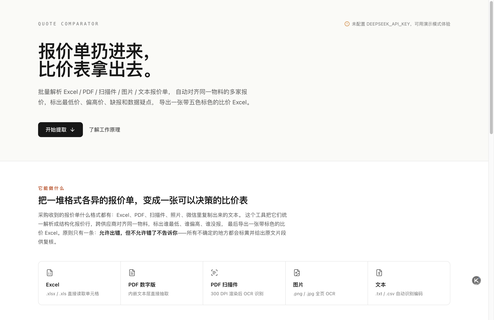
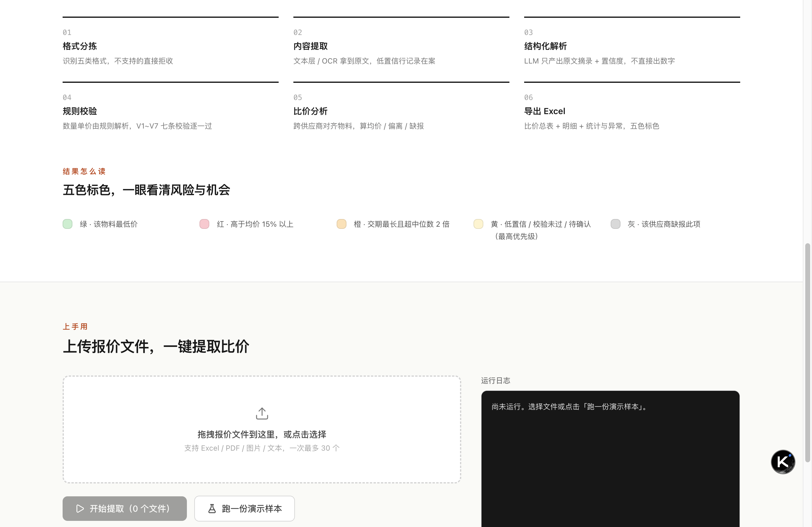
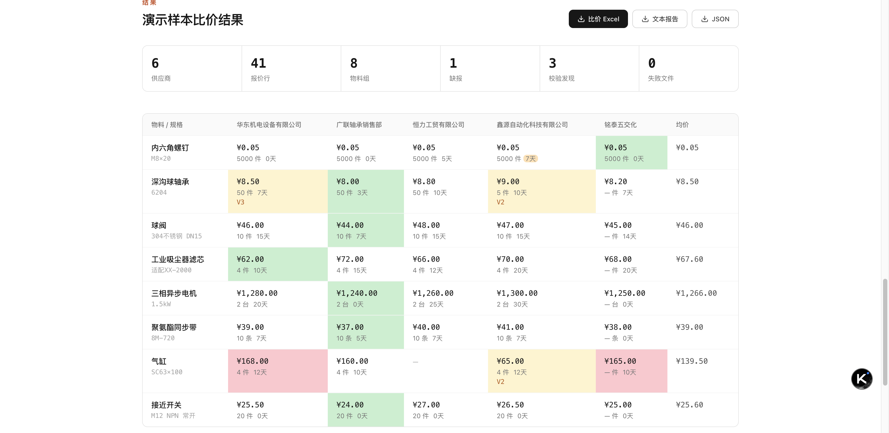
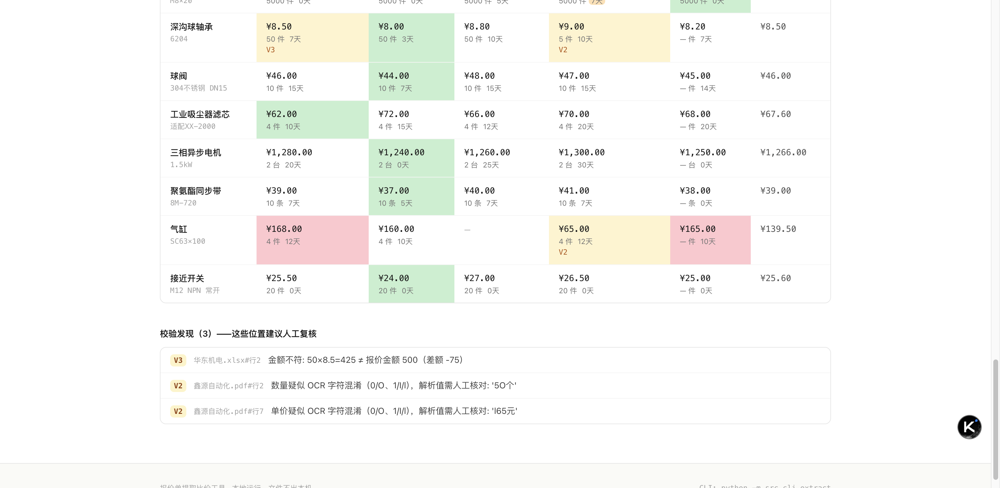

# 报价单提取比价工具（quote-comparator）

把一堆格式各异的供应商报价单（Excel / PDF / 扫描件 / 图片 / 文本）扔进来，
自动提取成统一结构化数据，跨供应商对齐同一物料，导出一张**带五色标色的比价 Excel**。

> 核心原则：**允许出错，但不允许错了不告诉你** —— 所有不确定的字段都会标黄并附原文片段，供人工复核。

## 功能

- **五类格式通吃**：`.xlsx/.xls` 直接读单元格；数字版 PDF 抽文本层；扫描件 PDF 与图片走 300 DPI + OCR；`.txt/.csv` 自动识别编码
- **六阶段流水线**：格式分拣 → 内容提取/OCR → LLM 结构化解析 → 规则校验（V1~V7）→ 跨供应商比价 → 导出 Excel
- **比价矩阵**：同一物料多家报价横向对齐，自动计算均价、偏离度、缺报
- **五色标色预警**：
  | 颜色 | 含义 |
  |---|---|
  | 🟩 绿 | 该物料最低价 |
  | 🟥 红 | 高于均价 15% 以上 |
  | 🟧 橙 | 交期最长且超过中位数 2 倍 |
  | 🟨 黄 | 低置信 / 校验未过 / 待确认匹配（最高优先级，覆盖其他颜色） |
  | ⬜ 灰 | 该供应商缺报此项 |
- **容错批处理**：单个文件损坏或解析失败不中断整批，失败清单进"统计与异常" Sheet，原文原样导出供排查
- **断点续跑**：中间产物分阶段缓存，二次运行只跑增量

## 界面截图









## 快速开始

### 环境要求

- Python 3.11+ 与 Node.js 20+
- 一个 OpenAI 兼容的 LLM 端点（默认 DeepSeek，可一键切换本地 vLLM 等）

### 一键启动（Web UI，推荐）

```bash
./start.sh          # 首次自动创建虚拟环境、安装依赖，随后同时拉起前端与后端
# macOS 也可以直接双击「启动工具.command」
```

打开终端提示的地址（默认 http://localhost:3000）：

- 未配置 API Key 也没关系，点「**跑一份演示样本**」即可离线体验完整流程（内置 6 份虚拟报价，不消耗 API）；
- 处理真实文件前先配置 Key：

```bash
export DEEPSEEK_API_KEY="sk-..."
```

### 命令行（可选）

```bash
.venv/bin/python -m src.cli extract ./报价文件夹 -o 比价结果.xlsx [--force]
```

输出三份产物：比价 Excel（比价总表 / 明细数据 / 统计与异常 / 解析失败原文）、`*.result.json`（完整结构化结果）、`*.report.txt`（人读摘要）。

### 手动安装

```bash
python3 -m venv .venv
.venv/bin/pip install -e ".[dev,web,ocr]"
cd web && npm install
```

## 技术架构

```
报价文件 ──► 格式分拣 ──► 内容提取 ──► LLM 结构化 ──► 规则校验 ──► 比价分析 ──► Excel 导出
            (类型识别)   (文本层/OCR)   (原文摘录+置信度)  (V1~V7)    (对齐/均价/缺报)  (五色标色)
                 │             │              │
                 ▼             ▼              ▼
            不支持的格式    OpenCV 矫正    所有数字计算只发生在规则与比价阶段，
            直接拒收       低置信行在案    LLM 输出层禁止出现计算值（防幻觉）
```

| 层 | 技术选型 |
|---|---|
| 前端 | Vite + React 19 + TypeScript + Tailwind CSS + shadcn/ui |
| Web 后端 | FastAPI（任务制包装流水线，产物按任务隔离） |
| 流水线 | Python 纯函数阶段模块（`run(input, config) -> output`），pydantic 数据模型贯穿 |
| LLM | OpenAI 兼容客户端，JSON Schema 结构化输出、指数退避重试、离线回放模式 |
| OCR | rapidocr-onnxruntime（PP-OCR 模型家族，ONNX 轻量推理）；引擎可插拔，装 `paddlepaddle + paddleocr` 后自动优先 PaddleOCR |
| 导出 | openpyxl 多 Sheet + PatternFill 五色标色 |

关键设计：

- **LLM 只摘录、不计算**：数量、单价、金额的解析与核对全部由规则代码完成，LLM 仅产出原文片段 + 置信度，从机制上防幻觉；
- **H1 溯源硬校验**：LLM 返回的原文片段必须能在源文件文本中找到，找不到即标黄；
- **所有标黄可追溯**：每条校验发现都带 `文件名#行号 + 规则号 + 说明`。

## 配置

`config/settings.yml`：LLM 端点与模型、OCR 参数、比价阈值（偏离 15% / 金额容差 ±2% / 交期 2 倍）等。
API Key 一律走环境变量（默认 `DEEPSEEK_API_KEY`），不写进配置文件。

## 测试

```bash
.venv/bin/python -m pytest    # 153 项测试：各阶段单测 + 端到端回归 + Web 接口，全程离线回放，无需 API Key
```

## 文档

- `报价单提取比价工具-设计方案.md` —— 完整设计方案（目标 / 非目标、流水线契约、校验规则 V1~V7、验收标准）
- `DEVELOPMENT.md` —— 开发进度、测试口径、新增样本方法
- `BACKLOG.md` —— 需求池（明确不做 / 后续版本）
